# Rendin 3D Reconstruction PoC

Post-processing pipeline for iOS ARKit scan data: RGB + LiDAR depth + confidence maps → coloured point cloud → Poisson surface mesh → floor plan SVG → labelled architectural element mesh.

> **AI disclosure** — the majority of this code was written with the assistance of **Claude Sonnet 4.6** (via GitHub Copilot Chat). Prompts, architecture decisions, coordinate-convention debugging, and final review were done by the human author.

---

## Pipeline stages

| Stage | What happens | Output |
|-------|-------------|--------|
| **1 — Back-projection** | Every valid depth pixel from every frame is unprojected to camera space with the (scaled) ARKit intrinsics, then transformed to gravity-aligned world space via the `worldFromCamera` extrinsic. Points below `min_confidence` or beyond `max_depth` are discarded. Frames whose `trackingState ≠ normal` are skipped entirely. | `output_pointcloud.ply` |
| **2 — Downsample / filter** | Voxel downsampling collapses each 0.05 m cell to one point. Statistical outlier removal (20 neighbours, 2 σ) strips floating noise from glass/specular returns. A pass-through axis filter is available but disabled by default. | `downsampled_pointcloud.ply` |
| **3 — Surface reconstruction** | Screened Poisson reconstruction on the normal-estimated filtered cloud. Low-density extrapolated boundary vertices are trimmed at the 1st-percentile density threshold. Vertex colours are transferred from the nearest point-cloud neighbour. Ball-pivoting and Alpha-shape methods are wired up and can be enabled for comparison. | `reconstructed_mesh_poisson.ply` |
| **4 — Floor plan** | Floor plane found via RANSAC; points in the `wall_height_min`–`wall_height_max` band projected to a 2-D occupancy grid. Columns with insufficient vertical extent (furniture tops) are removed; morphological closing fills gaps; small components are filtered. Result saved as an SVG. | `floor_plan.svg` |
| **5 — Architectural elements** | Iterative RANSAC extracts up to `max_planes` planar segments. Each plane is classified as floor, ceiling, wall, window, or door using normal direction and a per-wall 2-D hole analysis. A Delaunay-triangulated surface mesh is built per plane with windows/doors cut out as quads. | `architectural_elements.ply` + `architectural_elements_mesh.ply` |

---

## Algorithm overview (Stage 5)

| Step | Method |
|------|--------|
| **Plane detection** | Iterative RANSAC — detect plane, remove inliers, repeat up to `max_planes = 20` |
| **Floor / Ceiling** | `\|n · Y\| > 0.85` → horizontal; sort by centroid Y → lowest = floor, highest = ceiling |
| **Walls** | `\|n · Y\| < 0.30` → vertical plane; normals quantized to dominant 90° pair via XZ angle histogram |
| **Windows / Doors** | Per-wall 2-D occupancy grid → `binary_fill_holes` → XOR to find interior holes; hole touching row 0 with door dimensions → door, otherwise → window |
| **Output** | Coloured PLY at `architectural_elements.ply` with per-label point counts |

---

## Dataset results

### Smaller meeting room — 87 valid frames

| Metric | Value |
|--------|-------|
| Raw fused cloud | 1,958,381 pts |
| After voxel (0.05 m) + SOR | **104,846 pts** |
| Poisson mesh | **186,268 verts / 368,833 tris** |
| Architectural mesh | 82,980 verts / 316,762 tris |
| Planes detected | 20 (11 horizontal, 9 walls) |
| Openings detected | 3 windows, 0 doors |
| Label breakdown | floor 12.4% · ceiling 29.2% · wall 37.4% · window 0.5% · unclassified 20.3% |

### Bigger half-office — 183 valid frames

| Metric | Value |
|--------|-------|
| Raw fused cloud | 4,529,681 pts |
| After voxel (0.05 m) + SOR | **262,338 pts** |
| Poisson mesh | **69,959 verts / 138,631 tris** |
| Architectural mesh | 182,358 verts / 691,762 tris |
| Planes detected | 20 (10 horizontal, 10 walls) |
| Openings detected | 7 windows, 0 doors |
| Label breakdown | floor 12.0% · ceiling 27.8% · wall 29.7% · window 0.3% · unclassified 30.2% |

---

## Runtime comparison

Measured on a single machine (conda `gs` env, CPU only).

| Stage | Description | Meeting room (87 frames) | Half-office (183 frames) |
|-------|-------------|:------------------------:|:------------------------:|
| 1 | Back-projection | 5.9 s | 9.2 s |
| 2 | Voxel + SOR | 2.6 s | 2.3 s |
| 3 | Poisson reconstruction | 34.1 s | 49.9 s |
| 4 | Floor plan extraction | 0.4 s | 0.4 s |
| 5 | Architectural elements | 5.3 s | 7.7 s |
| — | GIF rendering (6 × 48 frames) | ~0 s* | ~0 s* |
| **Total** | | **48.2 s** | **69.4 s** |

\* GIF render time is included in the stage timings above.

---

## Visualizations

360° GIFs are generated automatically for every PLY when `save_gifs: true` in `config.json`.

| Stage | Meeting room (87 frames) | Half-office (183 frames) |
|-------|:------------------------:|:------------------------:|
| **1 — Raw point cloud** | 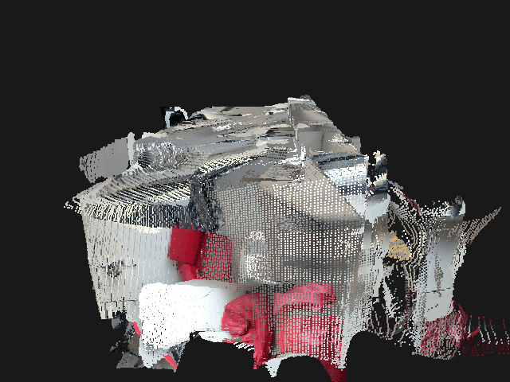<br><sub>1.96 M pts</sub> | 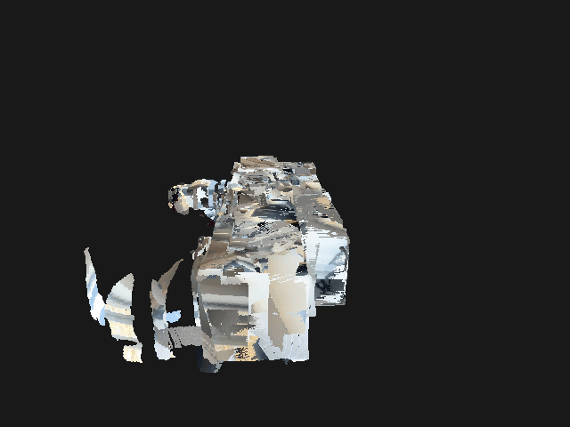<br><sub>4.53 M pts</sub> |
| **2 — Downsampled cloud** | 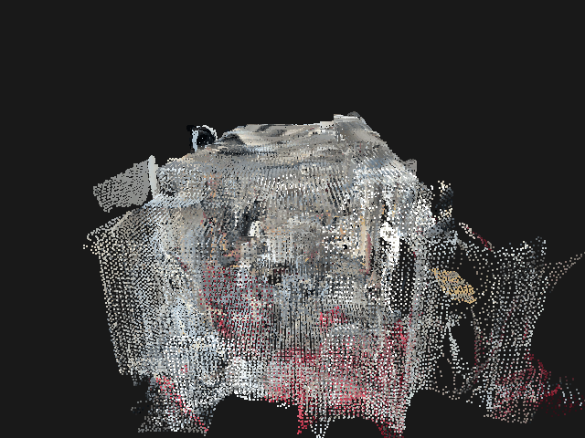<br><sub>104 k pts</sub> | 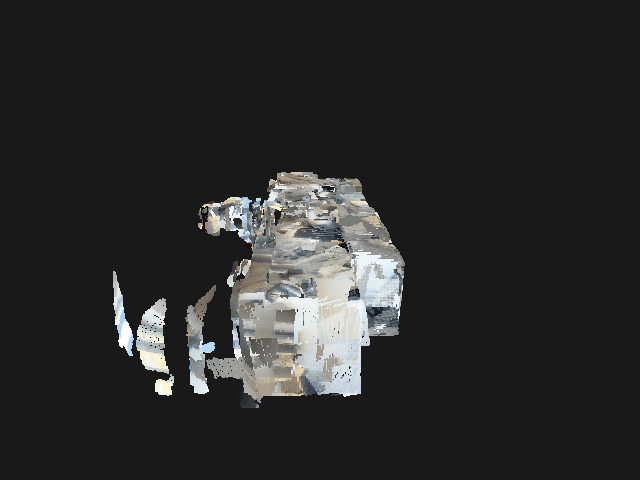<br><sub>262 k pts</sub> |
| **3 — Poisson mesh** | 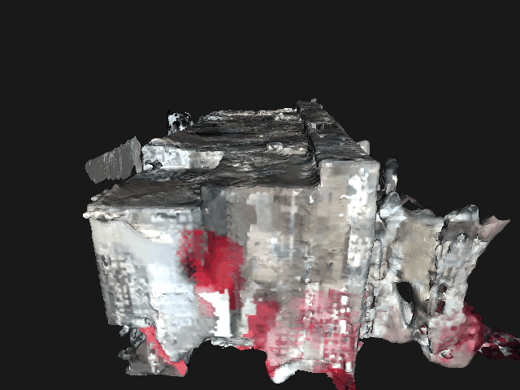<br><sub>186 k verts / 369 k tris</sub> | 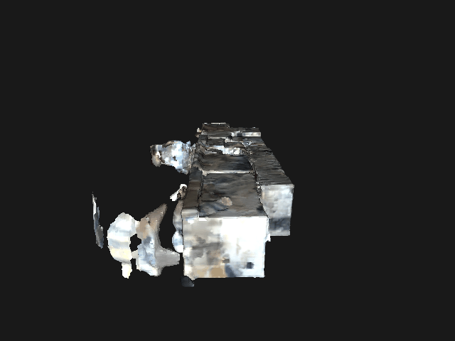<br><sub>70 k verts / 139 k tris</sub> |
| **4.1 — Floor plan** | 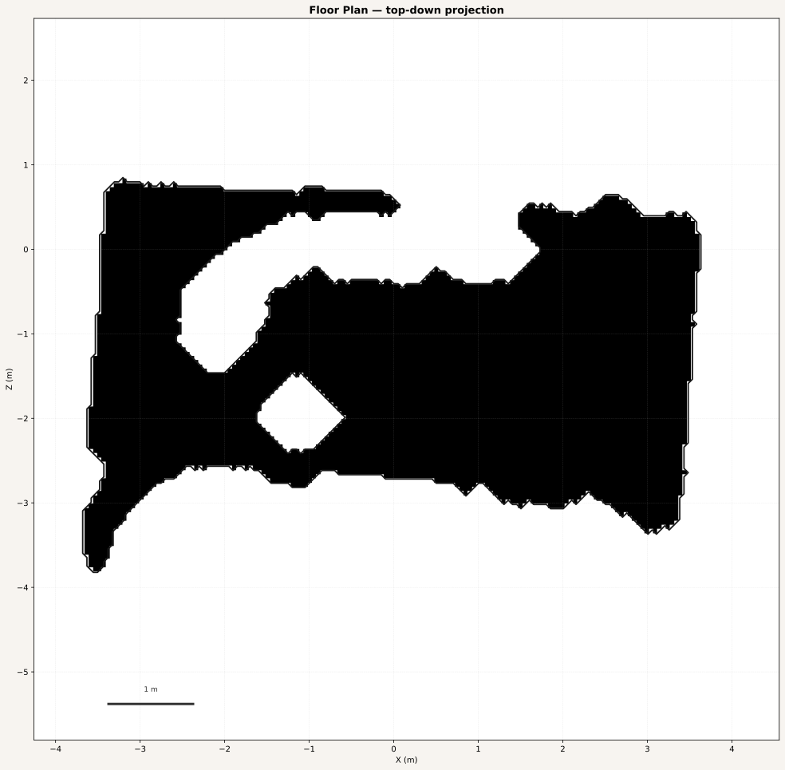 | 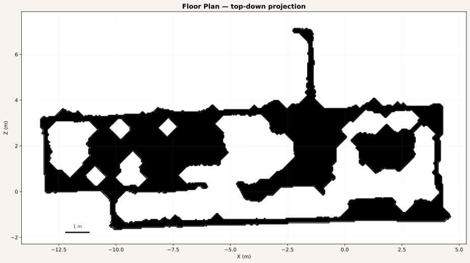 |
| **4.2 — Architectural elements** | 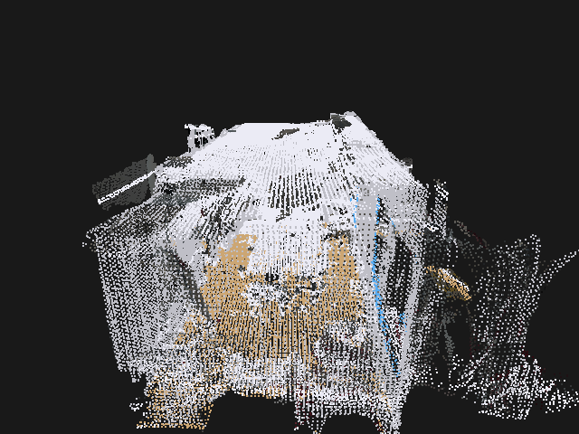<br><sub>coloured point cloud</sub> | 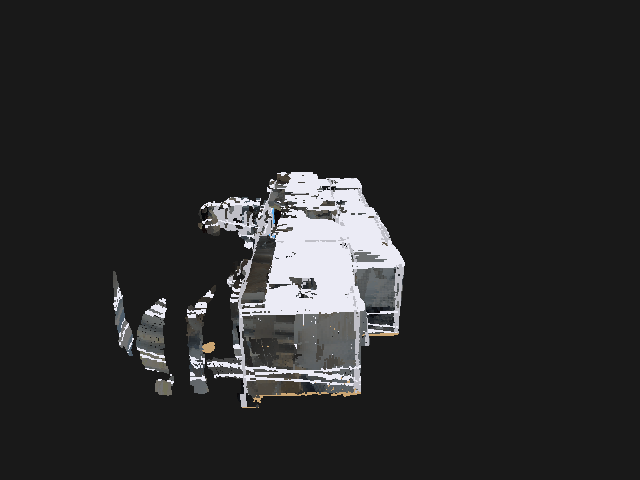<br><sub>coloured point cloud</sub> |
| **4.2 — Architectural mesh** | 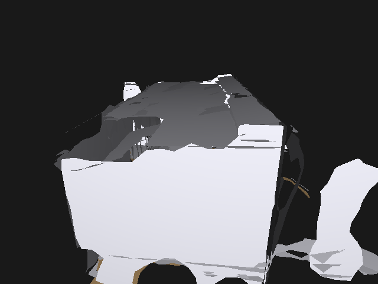<br><sub>83 k verts / 317 k tris</sub> | 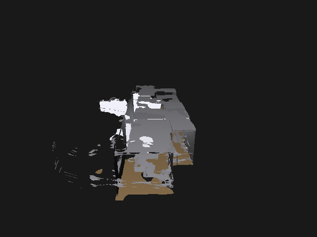<br><sub>182 k verts / 692 k tris</sub> |


---

## How to run


```bash
conda create -n iphone_3dreconstruction python=3.10.19 -y
conda activate iphone_3dreconstruction
pip install -r requirements.txt

python main.py config.json
```

`config.json` is the single argument. All paths, processing resolution, and algorithm parameters live there.

---

## Config reference

### Top-level

| Key | Default | Description |
|-----|---------|-------------|
| `dataset_path` | — | Path to folder of `frame_NNNNNN.*` files |
| `output_dir` | — | Output directory (created if missing) |
| `save_gifs` | `false` | Generate a 360° GIF alongside every PLY saved |
| `processing_height` | `192` | Reference height passed through to reader |
| `processing_width` | `144` | Reference width passed through to reader |

### `gif` block (used when `save_gifs: true`)

| Key | Default | Description |
|-----|---------|-------------|
| `frames` | `48` | Number of frames in the rotation |
| `fps` | `20` | GIF playback speed |
| `width` | `640` | Render width (px) |
| `height` | `480` | Render height (px) |
| `axis` | `"y"` | Rotation axis (`"x"`, `"y"`, or `"z"`) |
| `bg` | `[25, 25, 25]` | Background colour as `[R, G, B]` |
| `point_size` | `2.0` | Point radius for point-cloud renders |
| `elevation` | `20.0` | Camera elevation angle (degrees) |

### `backproject`

| Key | Default | Description |
|-----|---------|-------------|
| `enabled` | `true` | Run Stage 1 |
| `min_confidence` | `1` | ARKit confidence gate: 0 = low, 1 = medium, 2 = high |
| `max_depth` | `5.0` | Discard points beyond this distance (m) |
| `output_path` | `output_pointcloud.ply` | Filename within `output_dir` |

### `visualize`

| Key | Default | Description |
|-----|---------|-------------|
| `enabled` | `false` | Open an interactive Open3D window after each stage |
| `window_width` | `1280` | Window width (px) |
| `window_height` | `720` | Window height (px) |

### `pipeline.downsample`

| Key | Default | Description |
|-----|---------|-------------|
| `voxel_downsample.enabled` | `true` | Voxel-grid subsample |
| `voxel_downsample.voxel_size` | `0.05` | Cell size in metres |
| `statistical_outlier_removal.enabled` | `true` | Statistical outlier removal |
| `statistical_outlier_removal.nb_neighbors` | `20` | Neighbourhood size |
| `statistical_outlier_removal.std_ratio` | `2.0` | Outlier threshold (σ) |
| `pass_through_filter.enabled` | `false` | Axis-range crop (disabled by default — see Key Decisions) |
| `pass_through_filter.axis` | `"y"` | Axis to crop (`"x"`, `"y"`, or `"z"`) |
| `pass_through_filter.min_limit` | `-0.5` | Lower bound (m) |
| `pass_through_filter.max_limit` | `3.0` | Upper bound (m) |
| `output_path` | `downsampled_pointcloud.ply` | Filename within `output_dir` |

### `pipeline.surface_reconstruction`

| Key | Default | Description |
|-----|---------|-------------|
| `poisson_reconstruction.enabled` | `true` | Screened Poisson surface reconstruction |
| `poisson_reconstruction.depth` | `8` | Octree depth (higher = finer, slower) |
| `poisson_reconstruction.density_quantile_threshold` | `0.01` | Trim low-density extrapolated boundary vertices |
| `poisson_reconstruction.verbose` | `false` | Print Open3D solver output |
| `ball_pivoting.enabled` | `false` | Ball-pivoting algorithm |
| `ball_pivoting.radii` | `[0.05, 0.1, 0.2]` | Rolling ball radii (m) |
| `alpha_shapes.enabled` | `false` | Alpha-shape reconstruction |
| `alpha_shapes.alpha` | `0.1` | Alpha parameter |
| `output_path` | `reconstructed_mesh.ply` | Base filename; per-method suffix appended |

### `floor_plan`

| Key | Default | Description |
|-----|---------|-------------|
| `enabled` | `true` | Run Stage 4 |
| `output_path` | `floor_plan.svg` | Filename within `output_dir` |
| `resolution` | `0.05` | Occupancy-grid cell size (m/cell) |
| `wall_height_min` | `0.1` | Minimum height above floor included (m) |
| `wall_height_max` | `3.0` | Maximum height above floor included (m) |
| `min_vertical_extent` | `0.8` | Minimum column height to keep (m) — removes furniture tops |
| `min_component_area` | `0.5` | Minimum connected-region area to keep (m²) |
| `closing_iterations` | `8` | Morphological closing passes to fill gaps |

### `element_detection`

| Key | Default | Description |
|-----|---------|-------------|
| `enabled` | `true` | Run Stage 5 |
| `output_path` | `architectural_elements.ply` | Labelled point cloud |
| `max_planes` | `20` | Maximum RANSAC iterations |
| `min_plane_inliers` | `300` | Minimum inliers to accept a plane |
| `plane_distance_threshold` | `0.04` | RANSAC inlier distance (m) |
| `normal_vertical_threshold` | `0.85` | `\|n · Y\|` threshold for horizontal classification |
| `normal_horizontal_threshold` | `0.30` | `\|n · Y\|` upper bound for wall classification |
| `wall_resolution` | `0.05` | 2-D grid resolution for opening detection (m/cell) |
| `min_opening_area` | `0.15` | Minimum hole area to consider as an opening (m²) |
| `min_door_width` | `0.60` | Minimum door width (m) |
| `max_door_width` | `1.80` | Maximum door width (m) |
| `min_door_height` | `1.70` | Minimum door height (m) |
| `mesh_output_path` | `architectural_elements_mesh.ply` | Triangulated surface mesh per plane |
| `mesh_max_edge` | `0.30` | Maximum edge length in Delaunay planar patch (m) |
| `opening_offset` | `0.01` | Inset offset for window/door quad cutouts (m) |

---

## Key decisions

**Back-projection (Stage 1)**  
ARKit depth is stored in sensor-native landscape (`W=192 × H=144`). The intrinsics reference resolution is `1920×1440`, so the uniform scale is exactly 0.1 in both axes — no non-uniform distortion. The camera convention is OpenGL-style: +X right, +Y up, −Z forward. Image rows increase downward (−Y), so the y-ray direction is negated: `y_cam = −(v − cy)/fy × d`. Skipping `trackingState ≠ normal` frames prevents bad ARKit poses from polluting the fused cloud.

**Downsampling / filtering (Stage 2)**  
Voxel downsampling at 0.05 m gives a density-uniform cloud without needing a random subsample. SOR with (20 neighbours, 2σ) removes floating noise typical in LiDAR glass/specular returns. The pass-through Z-filter is **disabled by default** because ARKit world Y is up, not Z, and a Z-range crop would slice the scene sideways; use the Y axis if you want a height crop.

**Surface reconstruction (Stage 3)**  
Poisson reconstruction (`depth=8`) was chosen over Ball-Pivoting or Alpha Shapes because it produces a watertight, closed mesh even from non-uniform point densities, and Open3D's implementation is fast. The 1st-percentile density trim removes the low-confidence extrapolated boundary shell. Ball-Pivoting and Alpha Shapes are wired up and can be enabled in the config for comparison.

**Floor plan (Stage 4.1)**  
Rather than project all wall-height points, a vertical-extent filter (`min_vertical_extent = 0.8 m`) keeps only columns of occupied cells that span at least 0.8 m. This removes furniture tops, tables, and chairs from the 2-D footprint, leaving only structural walls.

**Architectural elements (Stage 4.2)**  
Iterative RANSAC is preferred over a single-pass plane fit because it handles multi-plane scenes cleanly — each iteration removes the dominant plane's inliers before the next fit. The horizontal/wall classification thresholds (0.85 / 0.30) leave a small gap that catches near-vertical slanted surfaces as neither horizontal nor wall, preventing misclassification of angled furniture. The XZ histogram approach for dominant wall directions ensures window/door grids are axis-aligned with the actual room geometry rather than the world frame.

---

## Assumptions and limitations

- **Depth ↔ RGB alignment assumed correct.** ARKit guarantees alignment at the stored depth resolution; no additional registration step is performed.
- **No ICP / pose refinement.** We trust ARKit's `worldFromCamera` poses directly. Drift can cause ghosting in long scans.
- **No TSDF / volumetric fusion.** Frames are back-projected independently and naively concatenated. Voxel downsampling mitigates but does not eliminate duplicate surface observations.
- **Colour transfer to mesh is nearest-neighbour.** Can look patchy near mesh boundaries.
- **No doors detected in either dataset.** Both scans show exterior-facing windows but no interior doorways within the `max_depth = 5 m` range, or the door geometry was not captured in a full floor-to-ceiling sweep.

---

## What went wrong / what I'd revisit

- **Coordinate convention bugs (found and fixed).** Three issues corrected: (1) `cv2.resize` rotated the depth image when `proc_h ≠ proc_w` because config values were portrait-shaped while stored depth is landscape; (2) non-uniform intrinsic scaling when using swapped dimensions; (3) missing y-axis sign flip (`y_cam` must be negated for OpenGL +Y-up cameras).
- **Pass-through filter default.** Original config had `z [0, 1.5]` which sliced almost the entire scene. Disabled by default.
- **Poisson on very sparse clouds.** After the pass-through filter was enabled the cloud dropped to ~25 k points and Poisson returned an empty mesh. Guard added; filter disabled.
- **Mesh detection in gif_maker.** Original code tried to read everything as a point cloud. Fixed by attempting `read_triangle_mesh` first and checking `len(triangles) > 0`.

---

## File layout

```
main.py                # pipeline entry point (Stages 1–5)
datareader.py          # HEIC + depth + confidence loader, frame iterator
backproject.py         # intrinsic scaling, back-projection, world transform
gif_maker.py           # 360° GIF renderer — works on any PLY (cloud or mesh)
config.json            # all runtime parameters

dataset/
  bigger___half_office_frames/
  smaller__meeting_room_frames/

output/<dataset>/
  output_pointcloud.ply                  # Stage 1: raw RGB point cloud
  output_pointcloud_360.gif
  downsampled_pointcloud.ply             # Stage 2: voxel + SOR filtered
  downsampled_pointcloud_360.gif
  reconstructed_mesh_poisson.ply         # Stage 3: Poisson surface mesh
  reconstructed_mesh_poisson_360.gif
  floor_plan.svg                         # Stage 4: 2-D top-down floor plan
  architectural_elements.ply             # Stage 5: labelled point cloud
  architectural_elements_360.gif
  architectural_elements_mesh.ply        # Stage 5: triangulated surface mesh
  architectural_elements_mesh_360.gif
  run_log.txt                            # full per-stage timing + stats log
```
